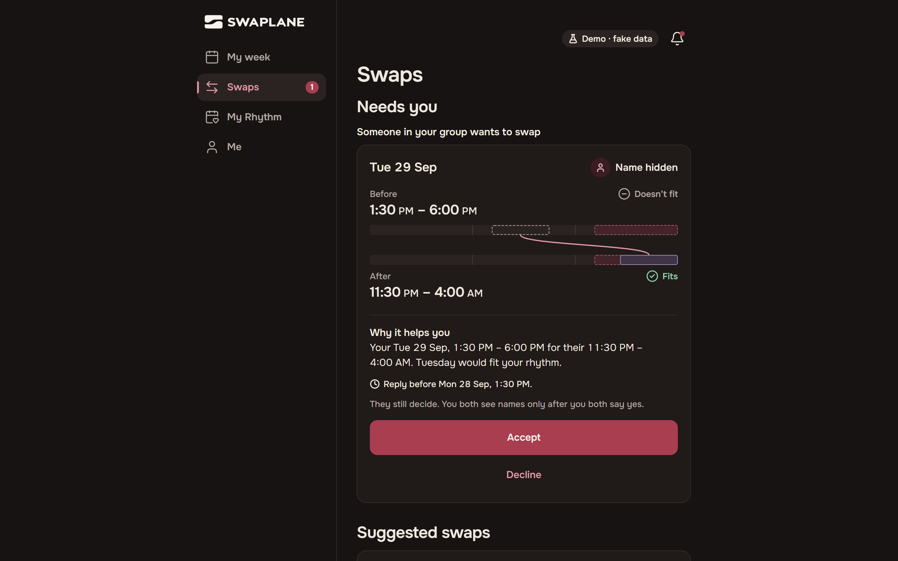
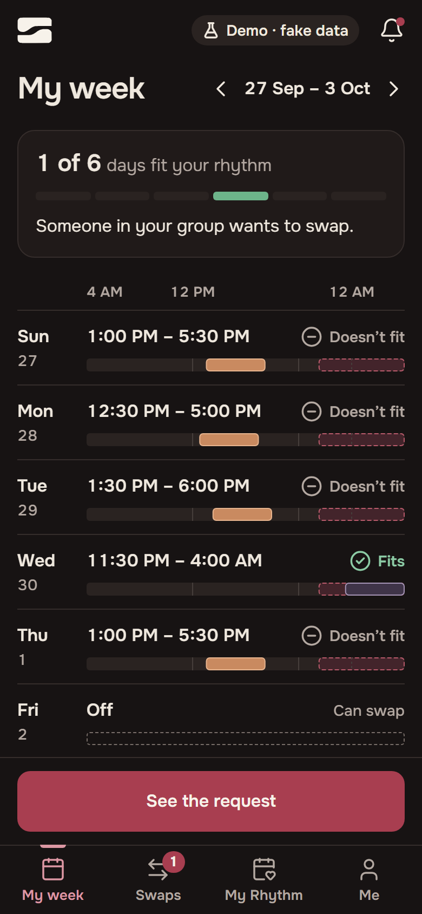
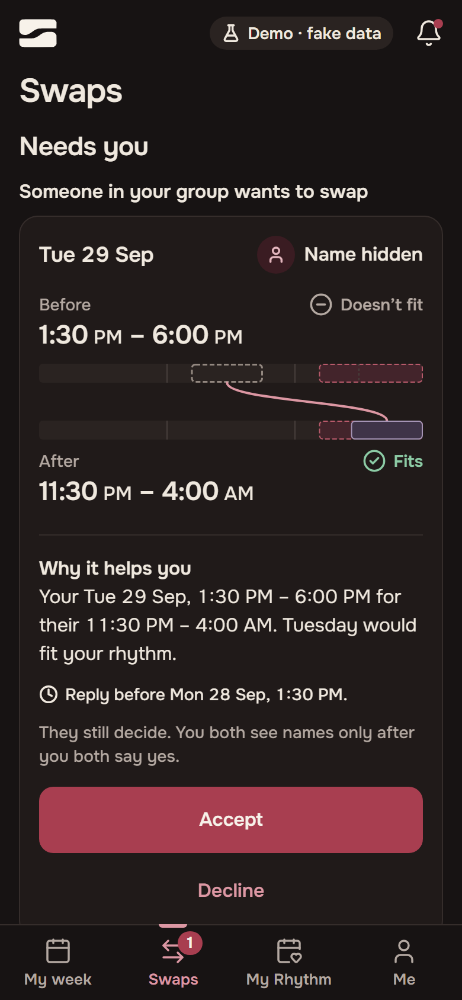

<!--
  Showcase README for the public repo arman-mahabad/swaplane.site.
  The code lives in a private repo. This repo holds only this page and its pictures.
-->

<a href="https://byarman.site">Made by Arman ↗</a>

# Swaplane

**A shift-swap app for teams that work in shifts. You say how you want your week to look, and it finds swaps that are fair to both people.**

[Try the demo ↗](https://swaplane.site) &nbsp;·&nbsp; Demo, invented data &nbsp;·&nbsp; The code is private. This page shows the product.

## How it works

**You set your rhythm once.** Your usual start time, the days you want off, and whether a night shift followed by an early one is fine for you.

**You see your week against it.** Each shift says whether it fits, and the top line counts the days that do.

**Swaplane suggests swaps that help both people.** Each one says why it helps you. The other person still decides, and you both see names only after you both say yes.

**You finish the swap in the official schedule.** That system stays where it is. Swaplane is the matchmaker in front of it.

  
  

## The decisions

**No AI decides who swaps.** The matching follows fixed rules. Picking the best set of swaps for a whole team is a known math problem, maximum-weight matching, and Swaplane solves it exactly with Edmonds' blossom algorithm. I chose exact math over a model's guess so that every match can be explained.

**Same input, same answer.** The engine never reads the clock and never uses randomness. Property tests generate teams of 50 to 200 people and check that every suggestion keeps the rules, and that the same team always gets the same list.

**Swap Day.** When the new schedule comes out, the engine can look at the whole group at once. Everyone gets the same chance at the same moment, so the good swaps stop going to whoever reads the group chat first. A test checks that the same shifts are still covered afterwards.

**Nothing comes from other websites.** Swaplane serves its own fonts and icons. Browser tests click through the app and check accessibility on the way.

`Next.js` `TypeScript` `Tailwind` `Radix` `Vitest` `fast-check` `Playwright` `axe`

I can walk you through the code on a call: [arman@byarman.site](mailto:arman@byarman.site)

More of my work: [byarman.site](https://byarman.site) &nbsp;·&nbsp; [github.com/arman-mahabad](https://github.com/arman-mahabad)

